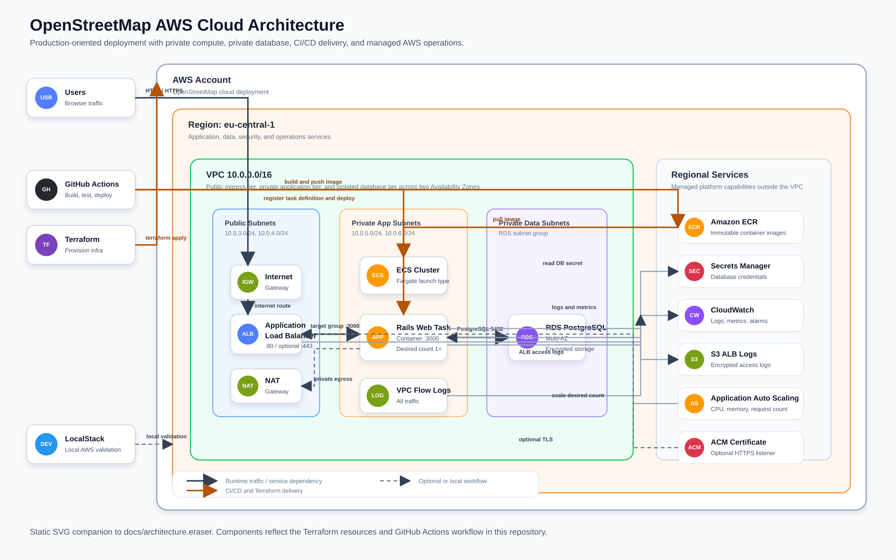

# OpenStreetMap Cloud Deployment


## Architecture Diagram

An Eraser diagram-as-code version with standard AWS icons is available at [`docs/architecture.eraser`](docs/architecture.eraser). A static SVG export is also available at [`docs/architecture.svg`](docs/architecture.svg).



This project provides a modern, secure, and scalable deployment of the OpenStreetMap website to AWS using Terraform, ECS (Fargate), and GitHub Actions. It supports local development with Docker Compose and is organized for multi-environment (dev, at, pr) workflows.

---

## Features

- **Modular Terraform**: All infrastructure code is in `terraform/`, with modules for network, secrets, and more.
- **Environment Segmentation**: Use `terraform/envs/dev.tfvars`, `at.tfvars`, and `pr.tfvars` for dev, acceptance, and production.
- **CI/CD**: Automated pipeline with linting, security checks, tests, and deployment (manual approval for production).
- **Secrets Management**: DB credentials managed via AWS Secrets Manager.
- **Security Best Practices**: Least-privilege security groups, no hardcoded secrets, and environment-based access control.

---

## Quick Start

### Local Development
```sh
cd openstreetmap-website
cp config/example.storage.yml config/storage.yml
cp config/docker.database.yml config/database.yml
docker compose build
docker compose up -d
docker compose run --rm web bundle exec rails db:migrate
```

### Terraform (Infrastructure)
```sh
cd terraform
terraform init
terraform workspace select dev # or at, pr
terraform apply -var-file="envs/dev.tfvars"
```

### CI/CD Pipeline
- On push to `main` (dev) or `at` branches, the pipeline runs linting, security checks, tests, and deploys automatically.
- For production (`pr`), deployment requires manual approval via GitHub Actions.

---

## Security & Production Notes

- Restrict SSH and HTTP access using `admin_cidr` and `http_cidr` variables in your tfvars files.
- Store all secrets in AWS Secrets Manager, not in version control.
- Use immutable image tags (commit SHA) for deployments.
- Monitor with CloudWatch, Prometheus, or Grafana.

---

## File Structure

- `terraform/` — All Terraform code and modules
- `terraform/envs/` — Environment-specific variable files
- `openstreetmap-website/` — External application source cloned locally or by CI when needed
- `.github/workflows/ci-ecr-deploy.yml` — CI/CD pipeline
- `scripts/` — Deployment and utility scripts

---

## Required GitHub Secrets for CI/CD

- `AWS_REGION` — e.g. `eu-central-1`
- `AWS_ACCOUNT_ID` — your AWS account id
- `AWS_ROLE_TO_ASSUME` (optional) — for role-based auth

---

## License

See `LICENSE` in the repo.
