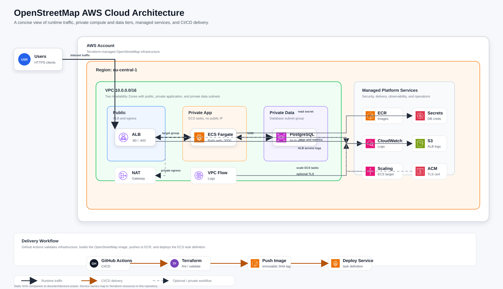

# OpenStreetMap Cloud Deployment


## Architecture Diagram

The latest architecture diagram is embedded below and available as a static SVG at [`docs/architecture-official-aws.svg`](docs/architecture-official-aws.svg). It uses official AWS Architecture Icon package assets stored in [`docs/assets/aws-icons`](docs/assets/aws-icons).

<p align="center">
  
</p>

The editable Eraser diagram-as-code source is available at [`docs/architecture.eraser`](docs/architecture.eraser).

This project provides a modern, secure, and scalable deployment of the OpenStreetMap website to AWS using Terraform, ECS (Fargate), ECR, and GitHub Actions OIDC. It supports local application development with Docker Compose and is organized for multi-environment AWS workflows (`dev`, `at`, and `pr`).

---

## Features

- **Modular Terraform**: All infrastructure code is in `terraform/`, with modules for network, secrets, and more.
- **Environment Segmentation**: Use `terraform/envs/dev.tfvars`, `at.tfvars`, and `pr.tfvars` for dev, acceptance, and production.
- **CI/CD**: A single AWS deployment pipeline with linting, security checks, tests, ECR image publishing, and Terraform deployment.
- **Secrets Management**: DB credentials managed via AWS Secrets Manager.
- **Security Best Practices**: Least-privilege security groups, no hardcoded secrets, and environment-based access control.

---

## Quick Start

### Local Development
```sh
cd openstreetmap-website
cp config/example.storage.yml config/storage.yml
cp config/docker.database.yml config/database.yml
docker compose build
docker compose up -d
docker compose run --rm web bundle exec rails db:migrate
```

### Terraform (Infrastructure)
```sh
cd terraform
terraform init \
  -backend-config="bucket=<terraform-state-bucket>" \
  -backend-config="key=openstreetmap/dev.tfstate" \
  -backend-config="region=eu-central-1" \
  -backend-config="dynamodb_table=<terraform-lock-table>" \
  -backend-config="encrypt=true"
terraform workspace select dev # or at, pr
terraform apply -var-file="envs/dev.tfvars"
```

### CI/CD Pipeline
- The repository uses one workflow: `.github/workflows/ci-ecr-deploy.yml`.
- The workflow authenticates to AWS with GitHub Actions OIDC using `AWS_ROLE_TO_ASSUME`; no long-lived AWS access keys are required.
- Each run resolves the latest `openstreetmap/openstreetmap-website` default branch (`master`; upstream does not currently use `main`) once, then tests, builds, tags, and deploys that exact OpenStreetMap commit.
- On push to `main`, the pipeline deploys the `dev` environment. On push to `at`, it deploys the `at` environment.
- Manual runs can deploy `dev`, `at`, or `pr` using the workflow dispatch environment input.
- The deployment sequence is: static Terraform checks, resolve latest OpenStreetMap source, Rails tests, ECR repository preparation, Docker image build/push, then Terraform plan/apply with the immutable OpenStreetMap image tag.

---

## Security & Production Notes

- Restrict SSH and HTTP access using `admin_cidr` and `http_cidr` variables in your tfvars files.
- Store all secrets in AWS Secrets Manager, not in version control.
- Use immutable image tags (commit SHA) for deployments.
- Monitor with CloudWatch, Prometheus, or Grafana.

---

## File Structure

- `terraform/` — All Terraform code and modules
- `terraform/envs/` — Environment-specific variable files
- `openstreetmap-website/` — External application source cloned locally or by CI when needed
- `.github/workflows/ci-ecr-deploy.yml` — CI/CD pipeline
- `scripts/` — Deployment and utility scripts

---

## Required GitHub Secrets for CI/CD

- `AWS_REGION` — e.g. `eu-central-1`
- `AWS_ACCOUNT_ID` — your AWS account id
- `AWS_ROLE_TO_ASSUME` — IAM role trusted by the GitHub Actions OIDC provider
- `TF_STATE_BUCKET` — S3 bucket for Terraform remote state
- `TF_STATE_LOCK_TABLE` — DynamoDB table for Terraform state locking
- `DB_PASSWORD` — production database password used by Terraform
- `DB_USERNAME` — production database username used by Terraform
- `DB_NAME` — production database name used by Terraform
- `KEY_NAME` — EC2 key pair name expected by the Terraform variables

The AWS role must trust GitHub's OIDC provider and allow this repository to assume it. Scope the trust policy to the target repository and branch or GitHub Environment where possible.

---

## License

See `LICENSE` in the repo.
